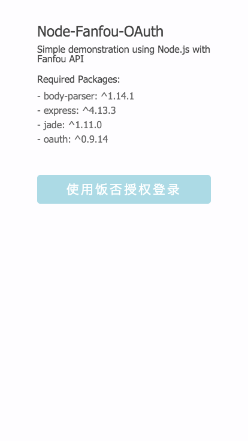
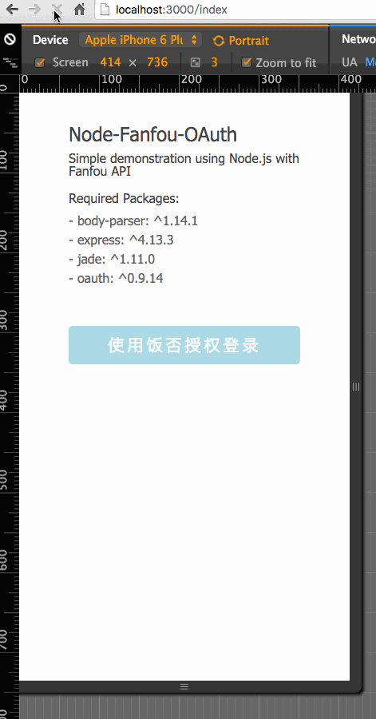
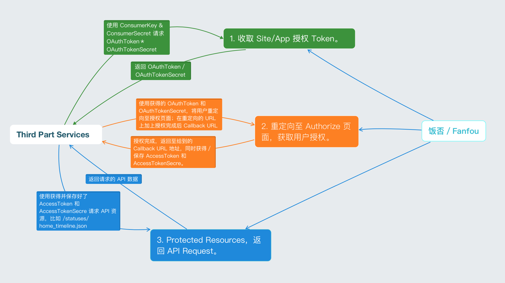

# Node-Fanfou-OAuth
Simple demonstration using Node.js with Fanfou API.

使用饭否提供的 OAuth 1.0 和 Node.js 进行登录授权的 Demo；目前只有登录授权后获取当前登录用户 Home Timeline 的功能。

##配置 Config 
1. 需要从[「饭否开放平台」](http://fanfou.com/apps)创建应用来获得运行 Node-Fanfou-OAuth 所必需的 app key 和 secret(AKA. consumer key 和 secret)；点击「创建新应用」，填入一般信息*（注：最后一项 `Callback URL` 在实际的授权过程中并非必须对应，在应用信息中填写的 `Callback URL` 可以与实际测试中的 `Callback URL` 不同）*；
2. Demo 本身基于 [Node.js](https://nodejs.org) 以及 [Express](http://expressjs.com/) 框架，如果没有 `Node.js` 部署在本机，请前往 [nodejs.org](https://nodejs.org/en/) 下载安装包进行安装，安装包一般都集成了 `npm`（用于 Node.js 包管理的工具）；
3. 安装项目相关依赖模块，打开系统 `terminal`，进入项目根目录，运行 `npm install`，等待片刻，npm 会按照 package.json 文件安装所依赖的模块；
4. 根目录下打开 `setting.default.js`，填入在第一步中获得的饭否应用的 consumer key 以及 secret，保存，将文件重命名为 `setting.js`；
5. 在 terminal 中运行 `node server.js`，启动应用；
6. 浏览器打开 `http://localhost:3000/index`，看到 `terminal` 回馈 `Basic Fanfou OAuth is now running on port 3000`，Node-Fanfou-OAuth 便已经运行在本机；
7. 「完」。

##关于饭否 OAuth 1.0 登录授权
详情请参考 [饭否API OAuth认证官方文档](https://github.com/FanfouAPI/FanFouAPIDoc/wiki/Oauth)，做了张图，可以对照官方的说明参考：

[官方文档的说明：](https://github.com/FanfouAPI/FanFouAPIDoc/wiki/Oauth#%E8%AE%A4%E8%AF%81%E6%B5%81%E7%A8%8B%E5%92%8C%E8%AE%BF%E9%97%AE%E6%B5%81%E7%A8%8B)
>1. 获取未授权的Request Token
>2. 请求用户授权Request Token，有回调url和pin码两种返回形式。
>3. 使用授权后的Request Token换取Access Token
>4. 使用 Access Token 访问饭否API

图中的绿色、橙色、蓝色，分别对应授权中的第一、第二、第三步，从上到下，依次进行。

